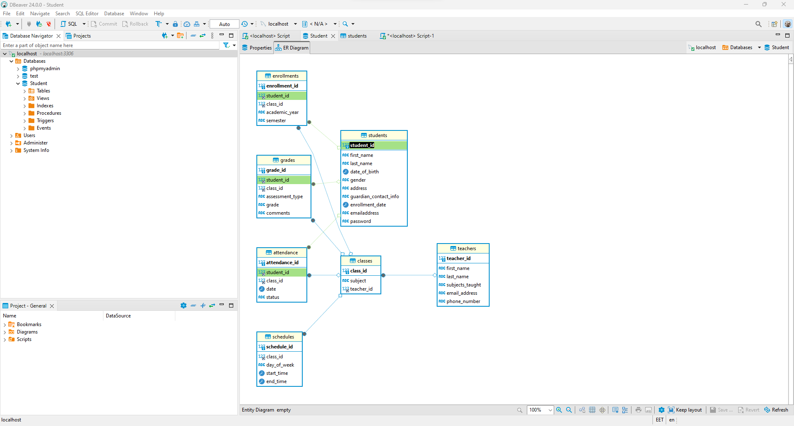

# # Baze de date Studenti

## Descriere
Proiectul "Baze de date Studenti" este o aplicație web care gestionează informații legate de studenți, notele lor, prezențele și materiile acestora folosind o bază de date MySQL. Aplicația include și un sistem de autentificare pentru fiecare student, oferindu-le acces la propriile lor date.

## Tehnologii folosite
- **Interfața utilizatorului (UI):** React
- **Server backend (API):** NodeJS si ExpressJS
- **Bază de date:** MySQL

## Funcționalități
- **Înregistrare și autentificare:** Studenții pot crea conturi și se pot autentifica pentru a accesa datele lor.
- **Gestionează informațiile studenților:** Permite adăugarea, modificarea și ștergerea datelor referitoare la studenți, cum ar fi numele, datele personale, notele și prezențele.
- **Gestionează informațiile despre materii:** Permite adăugarea și actualizarea datelor despre materii precum numele materiei, profesorul asociat și alte detalii relevante.
- **Vizualizare și gestionare note și prezențe:** Studenții și profesorii pot vizualiza și gestiona notele și prezențele asociate fiecărui student.
- **Securitate:** Asigură securitatea datelor prin intermediul autentificării și autorizării pentru a proteja datele sensibile ale studenților.

Acum, poți accesa aplicația într-un browser la adresa `http://localhost:3000`.

## Contribuții
Contribuțiile sunt binevenite! Dacă dorești să contribui la dezvoltarea acestui proiect, te rugăm să urmezi următorii pași:
1. Fork-uieste acest repository.
2. Creează un branch nou pentru funcționalitatea pe care dorești să o adaugi (`git checkout -b feature/noua-functie`).
3. Adaugă și comite schimbările tale (`git commit -am 'Adaugă o nouă funcționalitate'`).
4. Push-uieste branch-ul către repository-ul tău fork (`git push origin feature/noua-functie`).
5. Trimite un Pull Request către branch-ul principal al acestui repository.

## Diagrama database

## Autor
Acest proiect a fost creat de [Anna Dezsi](https://github.com/AnnaDezsi), [Chis Larisa](https://github.com/larisachis).

